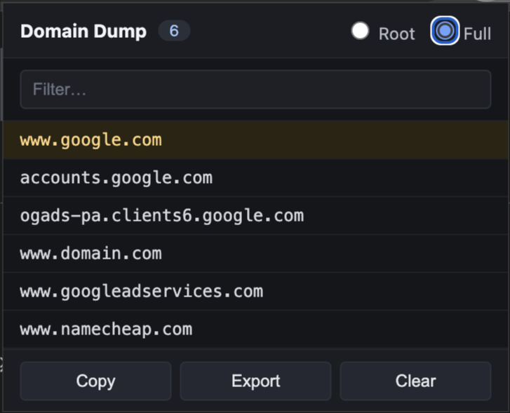

# Domain Dump

Chrome extension (Manifest V3) that lists every domain a site contacts while it runs — scripts, CDNs, XHR/fetch, images, fonts, iframes, WebSockets, the works. Unique, deduplicated, with a toggle between **root domains** (eTLD+1) and **full hostnames**.



## Features

- Captures all network requests of the active tab via `chrome.webRequest`.
- Root-domain view uses the [Public Suffix List](https://publicsuffix.org/), so `cdn.foo.co.uk` collapses to `foo.co.uk`. No third-party JS — the PSL data is vendored and parsed by a small in-repo matcher.
- Per-tab isolation — list resets when you navigate to a new page.
- Filter box, copy to clipboard, export to `.txt`, clear.
- Site's own domain is highlighted at the top of the list.
- Dark-themed popup.

## Install (unpacked)

1. Open `chrome://extensions`.
2. Enable **Developer mode**.
3. Click **Load unpacked** and select this folder.
4. Click the extension icon on any page to see the captured domains.

## Structure

```
.
├── manifest.json       # MV3 manifest
├── background.js       # service worker: webRequest listener + per-tab store
├── popup.html          # popup markup
├── popup.css           # dark theme
├── popup.js            # popup logic (root/full toggle, filter, copy/export/clear)
├── vendor/
│   ├── psl-data.js     # Vendored Public Suffix List (MPL-2.0) as JSON
│   └── psl.js          # ~40-line matcher implementing the PSL algorithm
└── icons/              # 16/48/128 extension icons
```

## Permissions

- `webRequest` — observe network requests of the current tab.
- `webNavigation` — reset the per-tab list on top-frame navigation.
- `<all_urls>` — so requests on any site the user visits can be observed.

No data leaves the browser. Everything is kept in memory on the service worker and discarded when the tab closes.

## License

The extension code is licensed under the [MIT License](LICENSE).

The file [`vendor/psl-data.js`](vendor/psl-data.js) is a compiled snapshot of the [Public Suffix List](https://publicsuffix.org/) and is distributed under the [Mozilla Public License 2.0](https://mozilla.org/MPL/2.0/). Refer to [`vendor/psl.js`](vendor/psl.js) for the matcher implementation (MIT, same as the rest of the extension).

## Notes

- MV3 service workers can sleep; the `webRequest` listener is re-registered on wake-up, which is fine for the "open tab, use it, check the list" flow. If cross-restart persistence is ever needed, move storage to `chrome.storage.session`.
